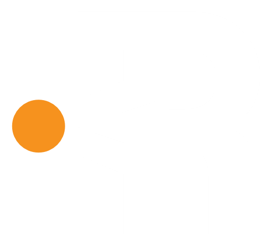

<!-- Improved compatibility of back to top link: See: https://github.com/othneildrew/Best-README-Template/pull/73 -->

<a id="readme-top"></a>

<!--
*** Thanks for checking out the Best-README-Template. If you have a suggestion
*** that would make this better, please fork the repo and create a pull request
*** or simply open an issue with the tag "enhancement".
*** Don't forget to give the project a star!
*** Thanks again! Now go create something AMAZING! :D
-->

<!-- PROJECT SHIELDS -->
<!--
*** I'm using markdown "reference style" links for readability.
*** Reference links are enclosed in brackets [ ] instead of parentheses ( ).
*** See the bottom of this document for the declaration of the reference variables
*** for contributors-url, forks-url, etc. This is an optional, concise syntax you may use.
*** https://www.markdownguide.org/basic-syntax/#reference-style-links
-->

[![Contributors][contributors-shield]][contributors-url]
[![Forks][forks-shield]][forks-url]
[![Stargazers][stars-shield]][stars-url]
[![Issues][issues-shield]][issues-url]
[![project_license][license-shield]][license-url]

<!-- PROJECT LOGO -->
<br />
<div align="center">
  <a href="https://github.com/IHT-SEDD/reca-play">
    
  </a>

<h3 align="center">RECA PLAY</h3>

  <p align="center">
    A platform to level up your activities with modern vibes and features that fit your sporty lifestyle
    <br />
    <br />
    <a href="https://github.com/github_username/repo_name">View Demo</a>
    &middot;
    <a href="https://github.com/github_username/IHT-SEDD/reca-play/new?labels=bug&template=bug-report---.md">Report Bug</a>
    &middot;
    <a href="https://github.com/github_username/IHT-SEDD/reca-play/new?labels=enhancement&template=feature-request---.md">Request Feature</a>
  </p>
</div>

<!-- TABLE OF CONTENTS -->
<details>
  <summary>Table of Contents</summary>
  <ol>
    <li>
      <a href="#about-the-project">About The Project</a>
      <ul>
        <li><a href="#built-with">Built With</a></li>
      </ul>
    </li>
    <li>
      <a href="#getting-started">Getting Started</a>
      <ul>
        <li><a href="#prerequisites">Prerequisites</a></li>
        <li><a href="#installation">Installation</a></li>
      </ul>
    </li>
    <li><a href="#usage">Usage</a></li>
    <li><a href="#roadmap">Roadmap</a></li>
    <li><a href="#contributing">Contributing</a></li>
    <li><a href="#license">License</a></li>
    <li><a href="#contact">Contact</a></li>
    <li><a href="#acknowledgments">Acknowledgments</a></li>
  </ol>
</details>

<!-- ABOUT THE PROJECT -->

## About The Project

[![Product Name Screen Shot][product-screenshot]](https://github.com/github_username/IHT-SEDD/reca-play)

RECA is a platform designed to level up your activities with a blend of modern vibes and sporty features.
It helps users stay engaged, track progress, and explore activities that match their active lifestyle.

✨ With RECA, you’ll get:

-   Fields & Events – discover and watch other activities easily.
-   Recordings – capture and revisit your moments anytime.
-   Personalized Profiles – manage your sporty journey in one place.
-   Secure & Seamless Access – smooth login, registration, and account management.

<p align="right">(<a href="#readme-top">back to top</a>)</p>

### Built With

-   [![Laravel][Laravel.com]][Laravel-url]
-   [![tailwindcss][TailwindCSS.com]][TailwindCSS-url]

<p align="right">(<a href="#readme-top">back to top</a>)</p>

<!-- GETTING STARTED -->

## Getting Started

To get a local copy up and running follow these simple example steps.

### Prerequisites

This is an example of how to list things you need to use the software and how to install them.

-   NPM
    ```sh
    npm install npm@latest -g
    ```
-   PHP 8.4 +
    ```sh
    https://windows.php.net/downloads/releases/php-8.4.11-nts-Win32-vs17-x64.zip
    ```
-   MySQL 5.7 +
    ```sh
    https://dev.mysql.com/get/Downloads/MySQL-5.7/mysql-5.7.39-winx64.zip
    ```
-   Laravel
    ```sh
    composer global require laravel/installer
    ```

### Installation

1. Clone the repo
    ```sh
    git clone https://github.com/IHT-SEDD/reca-play.git
    ```
2. Install NPM packages
    ```sh
    npm install
    ```
3. Dump autoload the project
    ```sh
    composer dump autoload
    ```
4. Change git remote url to avoid accidental pushes to base project
    ```sh
    git remote set-url origin github_username/repo_name
    git remote -v # confirm the changes
    ```
5. Change environment variables
    ```sh
    DB_CONNECTION=mysql
    DB_HOST=your_database_host # default is 127.0.0.1
    DB_PORT=your_database_port # default is 3306
    DB_DATABASE=your_database_name
    DB_USERNAME=your_database_username
    DB_PASSWORD=your_database_password
    ```
6. Run the database migrations
    ```sh
    php artisan migrate
    ```
7. Run the database seeder
    ```sh
    php artisan db:seed
    ```

<p align="right">(<a href="#readme-top">back to top</a>)</p>

<!-- USAGE EXAMPLES -->

## Usage

Use this space to show useful examples of how a project can be used. Additional screenshots, code examples and demos work well in this space. You may also link to more resources.

_For more examples, please refer to the [Documentation](https://example.com)_

<p align="right">(<a href="#readme-top">back to top</a>)</p>

<!-- CONTRIBUTING -->

## 🤝 Contributing

Contributions are what make the open source community such an amazing place to learn, inspire, and create. Any contributions you make are **greatly appreciated**.

If you have a suggestion that would make this better, please fork the repo and create a pull request. You can also simply open an issue with the tag "enhancement".
Don't forget to give the project a star! Thanks again!

📌 How to contribute

1. Fork the project
2. Create your Feature Branch → git checkout -b feature/AmazingFeature
3. Commit your Changes → git commit -m 'Add some AmazingFeature'
4. Push to the Branch → git push origin feature/AmazingFeature
5. Open a Pull Request 🎉

<p align="right">(<a href="#readme-top">back to top</a>)</p>

### 🏆 Top contributors:

Thanks to these wonderful people who make this project better 💖

<a href="https://github.com/IHT-SEDD/reca-play/graphs/contributors">
  
</a>

<!-- LICENSE -->

## License

Distributed under the RECA PLAY. See `LICENSE.txt` for more information.

<p align="right">(<a href="#readme-top">back to top</a>)</p>

<!-- CONTACT -->

## Contact

@reca.play - [@reca.play](https://instagram.com/reca.play)

email - [@email_handle](mail_to:email_handle)

Project Link: [https://github.com/IHT-SEDD/reca-play](https://github.com/IHT-SEDD/reca-play)

<p align="right">(<a href="#readme-top">back to top</a>)</p>

<!-- MARKDOWN LINKS & IMAGES -->
<!-- https://www.markdownguide.org/basic-syntax/#reference-style-links -->

[contributors-shield]: https://img.shields.io/github/contributors/IHT-SEDD/reca-play.svg?style=for-the-badge
[contributors-url]: https://github.com/IHT-SEDD/reca-play/graphs/contributors
[forks-shield]: https://img.shields.io/github/forks/IHT-SEDD/reca-play.svg?style=for-the-badge
[forks-url]: https://github.com/IHT-SEDD/reca-play/network/members
[stars-shield]: https://img.shields.io/github/stars/IHT-SEDD/reca-play.svg?style=for-the-badge
[stars-url]: https://github.com/IHT-SEDD/reca-play/stargazers
[issues-shield]: https://img.shields.io/github/issues/IHT-SEDD/reca-play.svg?style=for-the-badge
[issues-url]: https://github.com/IHT-SEDD/reca-play/issues
[license-shield]: https://img.shields.io/github/license/IHT-SEDD/reca-play.svg?style=for-the-badge
[license-url]: https://github.com/IHT-SEDD/reca-play/blob/master/LICENSE.txt
[linkedin-shield]: https://img.shields.io/badge/-LinkedIn-black.svg?style=for-the-badge&logo=linkedin&colorB=555
[linkedin-url]: https://linkedin.com/in/linkedin_username
[product-screenshot]: public/assets/img/others/home.png
[Next.js]: https://img.shields.io/badge/next.js-000000?style=for-the-badge&logo=nextdotjs&logoColor=white
[Next-url]: https://nextjs.org/
[React.js]: https://img.shields.io/badge/React-20232A?style=for-the-badge&logo=react&logoColor=61DAFB
[React-url]: https://reactjs.org/
[Vue.js]: https://img.shields.io/badge/Vue.js-35495E?style=for-the-badge&logo=vuedotjs&logoColor=4FC08D
[Vue-url]: https://vuejs.org/
[Angular.io]: https://img.shields.io/badge/Angular-DD0031?style=for-the-badge&logo=angular&logoColor=white
[Angular-url]: https://angular.io/
[Svelte.dev]: https://img.shields.io/badge/Svelte-4A4A55?style=for-the-badge&logo=svelte&logoColor=FF3E00
[Svelte-url]: https://svelte.dev/
[Laravel.com]: https://img.shields.io/badge/Laravel-FF2D20?style=for-the-badge&logo=laravel&logoColor=white
[Laravel-url]: https://laravel.com
[Bootstrap.com]: https://img.shields.io/badge/Bootstrap-563D7C?style=for-the-badge&logo=bootstrap&logoColor=white
[Bootstrap-url]: https://getbootstrap.com
[Tailwind CSS.com]: https://img.shields.io/badge/Tailwind%20CSS-06B6D4?style=for-the-badge&logo=tailwindcss&logoColor=white
[TailwindCSS-url]: https://tailwindcss.com/
[JQuery.com]: https://img.shields.io/badge/jQuery-0769AD?style=for-the-badge&logo=jquery&logoColor=white
[JQuery-url]: https://jquery.com
[@instagram_handle]: reca.play
[instagram_handle]: reca.play
